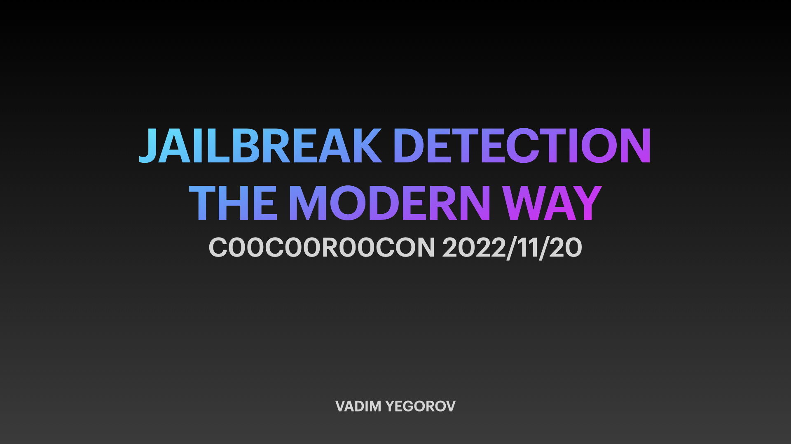
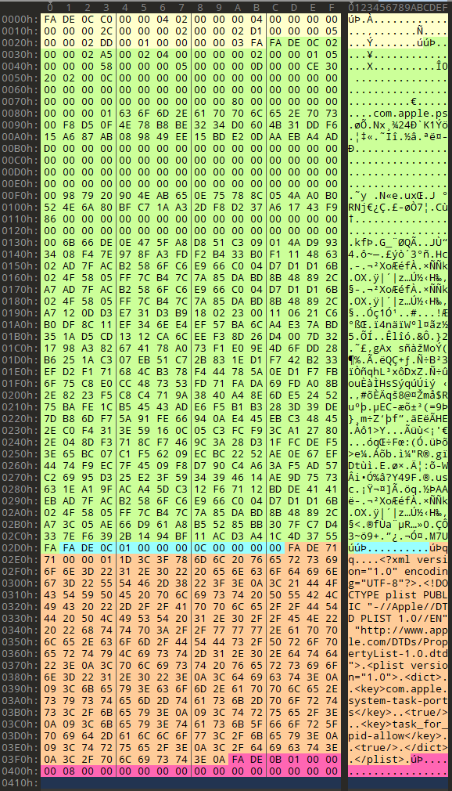

# Jailbreak detection: The modern way

<div align="left">
Nov 20 2022 by Vadim Yegorov &lt;vadimszzz@airmail.cc&gt;, Security Researcher, Software Engineer.
<hr>
<a rel="license" href="http://creativecommons.org/licenses/by-sa/4.0/"></a><br>
Licensed under a <a rel="license" href="http://creativecommons.org/licenses/by-sa/4.0/">Creative Commons Attribution-ShareAlike 4.0 International License</a>. Author should be mentioned when copying or redistributing this work.
</div>
<br>

<div align="center"></div>

Download PDF: [2022_C00C00R00CON_jailbreak.pdf](2022_C00C00R00CON_jailbreak.pdf)

<br>

# Introduction

- iOS
  - Closed operating system
  - JailBreaks bypass iOS security to get (almost) full access
- JailBreak detection
  - Used by banking applications and games
  - To make sure that the environment is “safe”…
  - …or to block cheats/cracks
- Security researchers need to
  - Assess / reverse protected applications

<br>

# Jailbreak detection

### Debugging an iOS app

- Without a JailBreak

  - With ptrace (lldb / frida) → app needs the get-task-allow entitlement

  - By injecting frida code → app needs to be repackaged

  - In both case, you need to resign the application

    but it has a lot of side effects:

    Different Team ID

    Files are modified

- With a JailBreak

  - No entitlements are required
  - Frida is able to attach to any process

<br>

### Jailbreak detection evasion

Jailbreak detection mechanisms are added to reverse engineering defense to make running the app on a jailbroken device more difficult. This blocks some of the tools and techniques reverse engineers like to use. Like most other types of defense, jailbreak detection is not very effective by itself, but scattering checks throughout the app's source code can improve the effectiveness of the overall anti-tampering scheme. 

The enterprise security risks posed by jailbreaking compound in the face of tools that can help users easily evade common jailbreak detection methods. A user can download any app tweak like Spotify++ directly from the third-party app store Cydia. A lot of applications provide jailbreak detection, as do many media and financial service apps that want to limit content pirating and account compromise, respectively. Unfortunately, these jailbreak detections rely on a combination of relatively straightforward and evadable tests, such as:

- Checking for files or directories common to jailbroken devices, such as Cydia
- Checking for elevated directory permissions (i.e. more directories with “write” permission)
- Checking to see if an app can successfully write files outside of its sandbox
- Checking cydia:// protocol handler

The fundamental limitation with these and comparable detection tests is that as client-side tests they can be accessed, reverse-engineered, and evaded by attackers. In addition, the apps performing these jailbreak detection tests (e.g. the MDM app) must go through Apple’s app review process, limiting the scope of data they can collect to analyse a device’s jailbreak status. Let's take a quick look at them:

<br>

### File based checks

Check for files and directories typically associated with jailbreaks, such as:

```swift
//suspicious system and app paths to check
private static var suspicousAppandSystemPaths: [String] {
    return [
        "/usr/sbin/frida-server",
        "/etc/apt/sources.list.d/electra.list",
        "/etc/apt/sources.list.d/sileo.sources",
        "/.bootstrapped_electra",
        "/usr/lib/libjailbreak.dylib",
        "/jb/lzma",
        "/.cydia_no_stash",
        "/.installed_unc0ver",
        "/jb/offsets.plist",
        "/usr/share/jailbreak/injectme.plist",
        "/etc/apt/undecimus/undecimus.list",
        "/var/lib/dpkg/info/mobilesubstrate.md5sums",
        "/Library/MobileSubstrate/MobileSubstrate.dylib",
        "/jb/jailbreakd.plist",
        "/jb/amfid_payload.dylib",
        "/jb/libjailbreak.dylib",
        "/usr/libexec/cydia/firmware.sh",
        "/var/lib/cydia",
        "/etc/apt",
        "/private/var/lib/apt",
        "/private/var/Users/",
        "/var/log/apt",
        "/Applications/Cydia.app",
        "/private/var/stash",
        "/private/var/lib/apt/",
        "/private/var/lib/cydia",
        "/private/var/cache/apt/",
        "/private/var/log/syslog",
        "/private/var/tmp/cydia.log",
        "/Applications/Icy.app",
        "/Applications/MxTube.app",
        "/Applications/RockApp.app",
        "/Applications/blackra1n.app",
        "/Applications/SBSettings.app",
        "/Applications/FakeCarrier.app",
        "/Applications/WinterBoard.app",
        "/Applications/IntelliScreen.app",
        "/private/var/mobile/Library/SBSettings/Themes",
        "/Library/MobileSubstrate/CydiaSubstrate.dylib",
        "/System/Library/LaunchDaemons/com.ikey.bbot.plist",
        "/Library/MobileSubstrate/DynamicLibraries/Veency.plist",
        "/Library/MobileSubstrate/DynamicLibraries/LiveClock.plist",
        "/System/Library/LaunchDaemons/com.saurik.Cydia.Startup.plist",
        "/Applications/Cydia.app",
        "/Applications/blackra1n.app",
        "/Applications/FakeCarrier.app",
        "/Applications/Icy.app",
        "/Applications/IntelliScreen.app",
        "/Applications/MxTube.app",
        "/Applications/RockApp.app",
        "/Applications/SBSettings.app",
        "/Applications/WinterBoard.app"
    ]
}
```

<br>


### File based checks

Most often, these are checked using the

`-(BOOL)fileExistsAtPath:(NSString*)` path method in NSFileManager or `FileManager.default.fileExists(atPath: path)`. However, there are also applications that use lower-level C functions like fopen(), stat(), or access().

<br>

### Checking File Permissions

Another way to check for jailbreaking mechanisms is to try to write to a location that's outside the application's sandbox. You can do this by having the application attempt to create a file in, for example, the `/private` directory. If the file is created successfully, the device has been jailbroken.

This method consists of checking the permissions of specific files and directories on the system. More directories have write access on a jailbroken device than on a non compromised one. One example of this is the root partition, which originally has only read permission. If it is found it has read and write permissions it means the device is jailbroken. There are different ways of performing these checks such as using NSFileManager and C functions like statfs().

**Swift:**

```swift
do {
    let pathToFileInRestrictedDirectory = "/private/jailbreak.txt"
    try "This is a test.".write(toFile: pathToFileInRestrictedDirectory, atomically: true, encoding: String.Encoding.utf8)
    try FileManager.default.removeItem(atPath: pathToFileInRestrictedDirectory)
    // Device is jailbroken
} catch {
    // Device is not jailbroken
}
```

**Objective-C:**

```objc
NSError *error;
NSString *stringToBeWritten = @"This is a test.";
[stringToBeWritten writeToFile:@"/private/jailbreak.txt" atomically:YES
         encoding:NSUTF8StringEncoding error:&error];
if (error == nil) {
   // Device is jailbroken
   return YES;
} else {
   // Device is not jailbroken
   [[NSFileManager defaultManager] removeItemAtPath:@"/private/jailbreak.txt" error:nil];
}
```

<br>

### Checking File Permissions

There are different ways of performing these checks such as using NSFileManager and C functions like statfs(), open(), utimes(), stat(), pathconf(), stat64(), fopen().

<br>

### Checking Protocol Handlers

You can check protocol handlers by attempting to open a Cydia URL. The Cydia app store, which practically every jailbreaking tool installs by default, installs the cydia:// protocol handler.

**Swift:**

```swift
if let url = URL(string: "cydia://package/com.example.package"), UIApplication.shared.canOpenURL(url) {
    // Device is jailbroken
}
```

**Objective-C:**

```objc
if([[UIApplication sharedApplication] canOpenURL:[NSURL URLWithString:@"cydia://package/com.example.package"]]){
    // Device is jailbroken
}
```

<br>

### Why it's not enough

This simple checks can be accessed, reverse-engineered, and evaded by attackers.

<br>

# Better ways of Jailbreak detection

<br>

### Try to block/detect debuggers

1. PT_DENY_ATTACH
```c
ptrace(PT_DENY_ATTACH);
```

2. Try to “kill” its own pid with the 0-signal
3. Check if PTRACE is flagged

```cpp
void try_kill() {
    const int pid = getpid();
    int ret = kill(pid, 0);
}
```

According to the man page of kill (`man 2 kill`), the signal `0` is used to check that the `pid` given in the first parameter really exists.

> […] A value of 0, however, will cause error checking to be performed (with no signal being sent). This can be used to check the validity of pid.

This *kill* operation is followed by `PTRACE` check:

```cpp
inline bool ptrace_detect() {
  int32_t opt[4] = {
    CTL_KERN,
    KERN_PROC,
    KERN_PROC_PID,
    getpid(),
  };
  kinfo_proc info;
  sysctl(opt, 4, &info, sizeof(kinfo_proc), nullptr, 0);
  return info.kp_proc.p_flag & P_TRACED;
}
```

<br>

### Check if the parent pid is launchd

```
getppid() == 1
```

<br>

### Try to detect if the rootfs is writable

```
getfsstat64(), statvfs()
```

<br>

### Try to load an invalid signature

```
fcntl(F_ADDSIGS)
```

<br>

### Check signature state

```
csops(CS_OPS_MARKKILL)
```

<br>

### Check signature directly

We can check the integrity of the signature of our binary. This check starts by opening the main app binary from the disk, seek till kSecCodeMagicEmbeddedSignature sequence `0xfade0cc0`, read the entitlements and calculate the checksum.

The code signing segment contains a superblob structure, which itself contains other blobs of different types. The structure of both is defined in some more [open-source Apple code](https://opensource.apple.com/source/Security/Security-55179.1/libsecurity_codesigning/lib/cscdefs.h):

```Cpp
/*
 * Structure of an embedded-signature SuperBlob
 */
typedef struct __BlobIndex {
	uint32_t type;					/* type of entry */
	uint32_t offset;				/* offset of entry */
} CS_BlobIndex;

typedef struct __SuperBlob {
	uint32_t magic;					/* magic number */
	uint32_t length;				/* total length of SuperBlob */
	uint32_t count;					/* number of index entries following */
	CS_BlobIndex index[];			/* (count) entries */
	/* followed by Blobs in no particular order as indicated by offsets in index */
} CS_SuperBlob;
```

The super blob just contains some magic, the length of the whole code signing section, a count of the blobs, and an array of indices to those blobs. The different identifying blob magics are defined in [this file](https://opensource.apple.com/source/libsecurity_codesigning/libsecurity_codesigning-55032/lib/CSCommonPriv.h):

```Cpp
/*
 * Magic numbers used by Code Signing
 */
enum {
  kSecCodeMagicRequirement = 0xfade0c00,				/* single requirement */
  kSecCodeMagicRequirementSet = 0xfade0c01,			/* requirement set */
  kSecCodeMagicCodeDirectory = 0xfade0c02,			/* CodeDirectory */
  kSecCodeMagicEmbeddedSignature = 0xfade0cc0, 	/* single-architecture embedded signature */
  kSecCodeMagicDetachedSignature = 0xfade0cc1, 	/* detached multi-architecture signature */
  kSecCodeMagicEntitlement = 0xfade7171,				/* entitlement blob */
};
```

For example, the iOS `ps` binary has four blobs of content following the initial superblob:



These are, respectively:

1. The code directory blob (magic `0xfade0c02`), which you can spot as it has the qualified binary name `com.apple.ps` in it.
2. An empty and short requirement set (magic `0xfade0c01`).
3. The entitlements blob, which contains the xml plist (magic `0xfade7171`).
4. A blob wrapper, (magic `0xfade0b01`).

<br>

### Complicate the backtracing

Try to halt the app after a big timeout and do not exit directly from the jailbreak detection place.

<br>

### API-based Detection

```
fork()
```

Process forking. Sandboxd does not deny applications the ability to use fork(), popen(), or any other C functions to create child processes on jailbroken devices. However, sandboxd explicitly denies process forking on non jailbroken devices. Therefore, by checking the returned pid on fork(), an application can tell if a device is compromised. If the fork is successful, the app can deduce that it is running on a jailbroken device.

```
system()
```

Calling the system() function with a NULL argument on a non-jailbroken device will return 0. Doing the same on a jailbroken device will return 1. This is because the function will check whether /bin/sh exists, and it only exists on jailbroken devices.

<br>

### OpenSSH service detection

SSH loopback connections. Due to the very large portion of jailbroken devices that have OpenSSH installed, some applications attempt to make a connection to 127.0.0.1 on port 22. If the connection succeeds, it means OpenSSH is installed and running, which proves the device is jailbroken.

Check loopback for 22 (OpenSSH) and 44 (checkra1n) opened ports.

<br>

### Check if some Jailbreak libraries are loaded in your process

This detection method starts with calling functions like `_dyld_image_count()` and `_dyld_get_image_name()` to see what dylibs are currently loaded. This method is very difficult to dynamically patch due to the fact that the patches themselves are part of dylibs.

`/usr/lib/substitute-inserter.dylib` for example

Can use dlopen / memory scanning / dyld internal structures etc.

```swift
private static func checkDYLD() -> Bool {
    let suspiciousLibraries = [
        "FridaGadget",
        "frida",
        "cynject",
        "libcycript"
    ]
    for libraryIndex in 0..<_dyld_image_count() {
        
        guard let loadedLibrary = String(validatingUTF8: _dyld_get_image_name(libraryIndex)) else { continue }
        for suspiciousLibrary in suspiciousLibraries {
            if loadedLibrary.lowercased().contains(suspiciousLibrary.lowercased()) {
                return true
            }
        }
    }
    return false
}
```

<br>

### Check if your process is instrumented

- Check code integrity
  - CRC, derive constants from the code, check API entries, etc.

- Try to detect frida

```swift
private static func isFridaRunning() -> Bool {
    func swapBytesIfNeeded(port: in_port_t) -> in_port_t {
        let littleEndian = Int(OSHostByteOrder()) == OSLittleEndian
        return littleEndian ? _OSSwapInt16(port) : port
    }
    
    var serverAddress = sockaddr_in()
    serverAddress.sin_family = sa_family_t(AF_INET)
    serverAddress.sin_addr.s_addr = inet_addr("127.0.0.1")
    serverAddress.sin_port = swapBytesIfNeeded(port: in_port_t(27042))
    let sock = socket(AF_INET, SOCK_STREAM, 0)
    
    let result = withUnsafePointer(to: &serverAddress) {
        $0.withMemoryRebound(to: sockaddr.self, capacity: 1) {
            connect(sock, $0, socklen_t(MemoryLayout<sockaddr_in>.stride))
        }
    }
    if result != -1 {
        return true
    }
    return false
}
```

<br>

# Summary

In general, the more complicated the jailbreak detection is, the more difficult it is to detect and bypass. The most common mistake when implementing jailbreak detection often lies in the implementation itself.  
<br>
We often come across apps that have great jailbreak detection, but the implementation is in one function that returns true or false depending on whether the device is jailbroken. In these cases, we bypass jailbreak detection by using Cycript or a similar tool to invert the return value from the detection function.  
<br>
In practice, the best jailbreak detection combining multiple techniques and integrating them into other functions so that they cannot easily be bypassed.

<br>

# References

https://github.com/mehrankmlf/SecurityKit  
https://www.synacktiv.com/sites/default/files/2021-10/2021_sthack_jailbreak.pdf  
https://www.romainthomas.fr/post/21-07-pokemongo-anti-frida-jailbreak-bypass/  
https://aeonlucid.com/Snapchat-detection-on-iOS/  
https://github.com/AeonLucid/SnapHide  
https://redmaple.tech/blogs/macho-files/  
